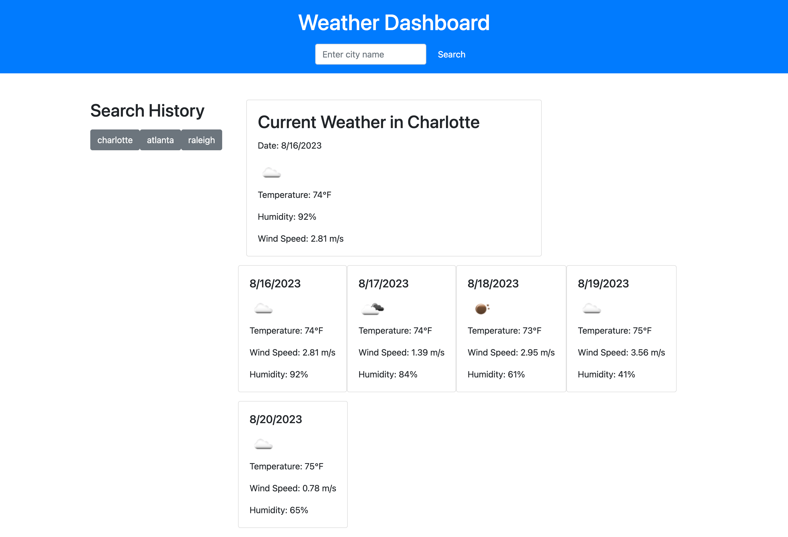

  # Module 6 Challenge

  

  ## Description
  This challenge project demonstrates the ability to create a weather dashboard app using javascript and OpenWeather API.

  ## Table of Contents 
  - [Usage](#usage)
  - [License](#license)
  - [Questions](#questions)

  ## Installation
  N/A

  ## Usage
  

  ## License
  MIT
  
  ## Questions
  If you have any questions I can be reached at delantetr@gmail.com.
  Github: https://github.com/delantetr/fictional-chainsaw
  Link: https://delantetr.github.io/fictional-chainsaw/
